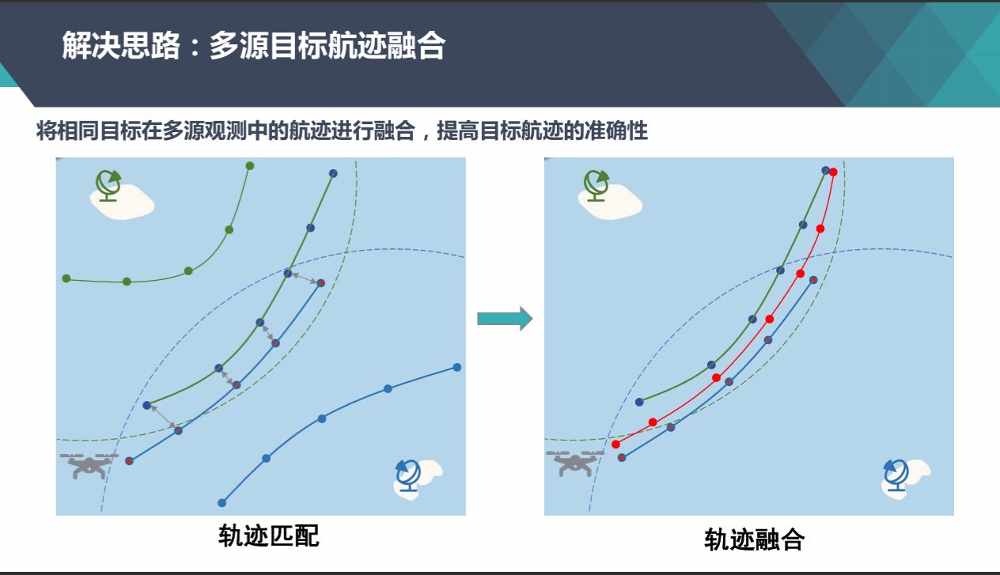
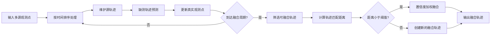

# 轨迹预测模块 (Trajectory Prediction Module)

## 核心功能

### 1. 数据接收与解析
- 自适应CSV文件读取，自动识别必选字段（ts/id/x/y/z）和辅助字段
- 智能时间格式解析，支持"MM:SS.mmm"等多种时间表示
- 动态字段装载，无需修改代码即可适配新数据源

### 2. 数据预处理
- **去重处理**：基于ts+id+x+y+z唯一标识删除重复数据
- **异常值过滤**：XYZ坐标范围校验（可配置）
- **数据清洗统计**：输出处理前后数据统计信息

### 3. 轨迹预测
#### 卡尔曼滤波预测
- 基于状态空间模型的最优估计
- 适用于线性运动目标的快速预测
- 计算开销小，实时性好

#### LSTM深度学习预测
- 基于PyTorch实现的长短期记忆网络
- 能够捕捉复杂非线性轨迹模式
- 支持模型持久化和增量训练

#### 混合预测（推荐）
- 加权融合卡尔曼和LSTM结果
- 默认权重：卡尔曼0.3 + LSTM 0.7
- 兼顾稳定性和准确性

### 4. 结果导出
- CSV格式预测结果导出
- JSON格式开发接口数据转换
- 时间戳格式与原数据保持一致

---

### 模块结构

```
prediction/
├── data_receiver.py          # 自适应数据接收器
├── data_preprocessor.py      # 数据预处理模块
├── predictor.py              # 轨迹预测核心模块
├── config.yaml               # 系统配置文件
│
├── main.py                   # 命令行批处理入口
├── app.py                    # Web API服务入口
│
├── models/                   # LSTM模型存储目录
│   ├── model_{id}.pth        # 各目标的LSTM模型
│   └── scaler_{id}.npy       # 对应的标准化器
│
└── data/                     # 数据目录
    ├── 1.csv                 # 示例输入数据
    └── predict_result.csv    # 预测结果输出
```

### 数据流向

```
CSV文件 → AdaptiveDataReceiver → DataPreprocessor → TrajectoryPredictor
                                    ↓
                            按ID分组 → 选择预测模式
                                    ↓
                          Kalman / LSTM / Hybrid
                                    ↓
                            结果导出 & 关联分析
```

---

## 快速开始

### 环境准备

**系统要求：**
- Python 3.8 或更高版本
- CUDA（可选，用于GPU加速LSTM训练）

**安装依赖：**

```bash
pip install flask pandas torch numpy scikit-learn pyyaml filterpy scipy
```

> 如需GPU加速，请根据CUDA版本安装对应版本的PyTorch：
> ```bash
> pip install torch --index-url https://download.pytorch.org/whl/cu118
> ```

### 运行方式

#### 方式一：命令行批处理

1. 准备CSV数据文件，放置在 `data/` 目录下
2. 编辑 `main.py` 选择预测模式：
   ```python
   PREDICT_MODE = "HYBRID"  # 可选：KALMAN / LSTM / HYBRID
   ```
3. 运行程序：
   ```bash
   python main.py
   ```
4. 查看结果：
   - 控制台输出统计信息
   - `data/predict_result.csv` - 预测结果文件

#### 方式二：Web API服务

1. 启动服务：
   ```bash
   python app.py
   ```
2. 访问可视化界面：
   ```
   http://127.0.0.1:5201
   ```
3. 上传CSV文件进行预测

---

## 配置说明

配置文件 `config.yaml` 包含所有可调参数：

### CSV读取配置
```yaml
csv:
  default_encoding: "utf-8"    # 文件编码
  delimiter: ","               # 分隔符
  header_row: 0                # 表头行号
```

### 数据预处理配置
```yaml
preprocess:
  x_range: [-180.0, 180.0]    # X坐标有效范围（经度）
  y_range: [-90.0, 90.0]      # Y坐标有效范围（纬度）
  z_range: [-1000.0, 10000.0] # Z坐标有效范围（高度）
```

### 预测配置
```yaml
predict:
  predict_steps: 15            # 预测未来点数（默认15步）
  
  # 卡尔曼滤波参数
  kalman:
    process_noise: 0.01        # 过程噪声协方差
    measure_noise: 0.1         # 测量噪声协方差
  
  # LSTM神经网络参数
  lstm:
    look_back: 5               # 历史窗口大小（使用前5个点预测）
    epochs: 30                 # 训练轮数
    batch_size: 2              # 批次大小
    units: 32                  # LSTM隐藏层单元数
    lr: 0.001                  # 学习率
    model_save_dir: "./models" # 模型保存路径
  
  # 混合预测权重
  hybrid:
    kalman_weight: 0.3         # 卡尔曼权重
    lstm_weight: 0.7           # LSTM权重
  
  # 输出配置
  output:
    result_csv_path: "data/predict_result.csv"  # 结果输出路径
```

### 参数调优建议

| 参数 | 调整方向 | 影响 |
|------|---------|------|
| `predict_steps` | 增大 | 预测更远未来，但精度可能下降 |
| `look_back` | 增大 | 考虑更长历史，需要更多训练数据 |
| `epochs` | 增大 | 训练更充分，但耗时增加 |
| `units` | 增大 | 模型容量更大，可能过拟合 |
| `kalman_weight` | 调整 | 平衡线性和非线性预测 |

---

## 使用示例

### 示例1：命令行批处理

```python
from data_receiver import AdaptiveDataReceiver
from data_preprocessor import DataPreprocessor
from predictor import TrajectoryPredictor

# 1. 读取数据
receiver = AdaptiveDataReceiver()
raw_data = receiver.load_csv("data/1.csv")

# 2. 数据预处理
preprocessor = DataPreprocessor(receiver.config)
clean_data = preprocessor.process(raw_data)

# 3. 按目标ID分组
predictor = TrajectoryPredictor(receiver.config)
grouped_data = predictor.group_by_id(clean_data)
print(f"🎯 目标总数：{len(grouped_data)}")

# 4. 执行预测（选择一种模式）
# 模式1：卡尔曼滤波
predict_result = predictor.predict_kalman(grouped_data)

# 模式2：LSTM深度学习
# predict_result = predictor.predict_lstm(grouped_data)

# 模式3：混合预测（推荐）
# predict_result = predictor.predict_hybrid(grouped_data)

# 5. 导出结果
if predict_result:
    predictor.export_to_csv(predict_result)
    print(f"✅ 预测完成，共 {len(predict_result)} 个目标")
```

### 示例2：Web API调用

```python
import requests

# 上传CSV文件进行预测
url = "http://127.0.0.1:5201/upload"
files = {"file": open("prediction/data/1.csv", "rb")}
response = requests.post(url, files=files)

result = response.json()
if result["ok"]:
    history = result["history"]  # 历史轨迹
    predict = result["predict"]  # 预测点
    assoc = result["assoc"]  # 关联轨迹
    print(f"✅ 预测成功！")
else:
    print(f"❌ 预测失败：{result['err']}")
```

### 示例3：自定义配置

```python
import yaml

# 加载配置
with open("config.yaml", "r", encoding="utf-8") as f:
    config = yaml.safe_load(f)

# 修改预测步数为30步
config["predict"]["predict_steps"] = 30

# 调整混合权重
config["predict"]["hybrid"]["kalman_weight"] = 0.4
config["predict"]["hybrid"]["lstm_weight"] = 0.6

# 创建预测器
predictor = TrajectoryPredictor(config)
```

---

## API接口

### 核心类说明

#### 1. AdaptiveDataReceiver（数据接收器）

**功能**：自适应CSV文件解析，自动识别字段

**初始化**：
```python
receiver = AdaptiveDataReceiver(config_path="./config.yaml")
```

**方法**：
```python
# 加载CSV文件
raw_data = receiver.load_csv("data/1.csv")
# 返回：List[RadarData]
```

**数据结构**：
```python
@dataclass
class RadarData:
    ts: datetime        # 时间戳
    id: Any             # 目标ID
    x: float            # X坐标
    y: float            # Y坐标
    z: float            # Z坐标
    aux: Dict[str, Any] # 辅助字段（自动识别）
```

---

#### 2. DataPreprocessor（数据预处理器）

**功能**：数据去重和异常值过滤

**初始化**：
```python
preprocessor = DataPreprocessor(config)
```

**方法**：
```python
# 执行预处理
clean_data = preprocessor.process(raw_data)
# 返回：List[RadarData]
```

**处理流程**：
1. 基于ts+id+x+y+z去重
2. XYZ坐标范围校验
3. 输出统计信息

---

#### 3. TrajectoryPredictor（轨迹预测器）

**功能**：核心预测引擎，支持三种预测模式

**初始化**：
```python
predictor = TrajectoryPredictor(config)
```

**方法**：

##### group_by_id - 按目标ID分组
```python
grouped_data = predictor.group_by_id(clean_data)
# 返回：Dict[target_id, List[RadarData]]
```

##### predict_kalman - 卡尔曼滤波预测
```python
result = predictor.predict_kalman(grouped_data)
```

##### predict_lstm - LSTM深度学习预测
```python
result = predictor.predict_lstm(grouped_data, train_new=True)
# train_new: 是否重新训练模型（默认True）
```

##### predict_hybrid - 混合预测
```python
result = predictor.predict_hybrid(grouped_data)
```

##### export_to_csv - 导出CSV
```python
predictor.export_to_csv(result, csv_path="data/predict_result.csv")
```

##### convert_to_develop_interface - 转换为开发接口格式
```python
interface_data = predictor.convert_to_develop_interface(result)
# 返回：Dict[time_str, List[Dict]]
```

**返回结果格式**：
```python
{
    target_id: {
        "predictions": [
            {
                "predict_ts": datetime,      # 预测时间（datetime对象）
                "predict_ts_str": "MM:SS.m", # 预测时间（字符串）
                "x": 116.4,                  # 预测X坐标
                "y": 39.9,                   # 预测Y坐标
                "z": 50.0,                   # 预测Z坐标
                "step": 1                    # 预测步数
            },
            ...
        ],
        "history_count": 100  # 历史数据点数
    }
}
```

---

## 数据格式

### 输入CSV格式

**必选字段**：

| 字段名 | 类型 | 说明 | 示例 |
|--------|------|------|------|
| ts | 字符串 | 时间戳 | "12:30.123" |
| id | 整数/字符串 | 目标唯一标识 | 1, 2, "target_001" |
| x | 浮点数 | X坐标（经度） | 116.4074 |
| y | 浮点数 | Y坐标（纬度） | 39.9042 |
| z | 浮点数 | Z坐标（高度） | 50.0 |

**辅助字段**：
- 自动识别并保留在 `RadarData.aux` 中
- 不影响预测逻辑
- 示例：speed, heading, radar_id等

**示例数据**：
```csv
ts,id,x,y,z,speed
12:30.123,1,116.4074,39.9042,50.0,12.5
12:31.456,1,116.4080,39.9050,51.0,13.0
12:30.234,2,116.5000,40.0000,52.0,11.8
```

### 输出CSV格式

```csv
ts,id,x,y,z
12:32.789,1,116.4090,39.9060,52.0
12:34.122,1,116.4100,39.9070,53.0
...
```

### Web API响应格式

```json
{
  "ok": true,
  "history": {
    "1": [
      {"ts": 1672531800.0, "lng": 116.4074, "lat": 39.9042, "z": 50.0},
      ...
    ]
  },
  "predict": [
    {"id": 1, "ts": "12:32.789", "lng": 116.4090, "lat": 39.9060, "z": 52.0},
    ...
  ],
  "assoc": [
    {"tra_id": 1, "ts": "12:30.123", "lng": 116.4074, "lat": 39.9042, "z": 50.0},
    ...
  ]
}
```

---

## 算法详解

### 1. 卡尔曼滤波（Kalman Filter）

#### 原理
卡尔曼滤波是一种递归的状态估计算法，通过预测-更新两步循环，对系统状态进行最优估计。

#### 实现细节
```python
# 状态向量：[x, y, z]
# 观测模型：直接观测位置
# 状态转移：基于速度外推

# 预测步骤
p_predict = p + Q  # 协方差预测
x_pred = x_est     # 状态预测

# 更新步骤
K = p_predict / (p_predict + R)  # 卡尔曼增益
x_est = x_pred + K * (z_meas - x_pred)  # 状态更新
p = (1 - K) * p_predict  # 协方差更新
```

#### 多步预测
```python
# 基于最后两点的速度进行递推外推
vx = last_x - prev_x
vy = last_y - prev_y
vz = last_z - prev_z

next_x = last_x + vx
next_y = last_y + vy
next_z = last_z + vz
```

#### 优缺点
- ✅ **优点**：计算快、稳定性好、适合线性运动
- ❌ **缺点**：难以捕捉复杂非线性轨迹

---

### 2. LSTM神经网络

#### 原理
长短期记忆网络（LSTM）是一种特殊的循环神经网络（RNN），能够学习长期依赖关系，适合时序预测任务。

#### 网络结构
```python
class TrajectoryLSTM(nn.Module):
    def __init__(self, input_size=3, hidden_size=32, output_size=3, predict_steps=15):
        super().__init__()
        self.lstm = nn.LSTM(input_size, hidden_size, batch_first=True)
        self.fc = nn.Linear(hidden_size, output_size * predict_steps)
    
    def forward(self, x):
        out, _ = self.lstm(x)
        out = self.fc(out[:, -1, :])  # 取最后一个时间步
        out = out.view(-1, predict_steps, 3)
        return out
```

#### 数据预处理
```python
# 1. 构建序列样本
# 输入：[t-5, t-4, t-3, t-2, t-1] -> 输出：[t]
X, y = [], []
for i in range(look_back, len(data)):
    X.append(data[i-look_back:i])
    y.append(data[i])

# 2. MinMaxScaler标准化
scaler = MinMaxScaler()
coords_scaled = scaler.fit_transform(coords)

# 3. 训练模型
model.train()
for epoch in range(epochs):
    outputs = model(X)
    loss = criterion(outputs, y)
    loss.backward()
    optimizer.step()
```

#### 模型持久化
```python
# 保存
torch.save({
    'model_state_dict': model.state_dict(),
    'predict_steps': predict_steps
}, f"models/model_{target_id}.pth")

np.save(f"models/scaler_{target_id}.npy", [scaler.min_, scaler.scale_])

# 加载
checkpoint = torch.load(path, map_location=device)
model.load_state_dict(checkpoint['model_state_dict'])
```

#### 优缺点
- ✅ **优点**：能捕捉复杂轨迹模式、适应性强、精度高
- ❌ **缺点**：需要足够训练数据、计算开销大、训练时间长

---

### 3. 混合预测（Hybrid）

#### 原理
加权融合卡尔曼滤波和LSTM的预测结果，结合两者的优势。

#### 融合公式
```python
x_hybrid = kalman_weight * x_kalman + lstm_weight * x_lstm
y_hybrid = kalman_weight * y_kalman + lstm_weight * y_lstm
z_hybrid = kalman_weight * z_kalman + lstm_weight * z_lstm
```

#### 默认权重
- 卡尔曼权重：0.3
- LSTM权重：0.7

#### 权重调优建议
- **线性运动为主**：提高卡尔曼权重（如0.5:0.5）
- **复杂轨迹为主**：提高LSTM权重（如0.2:0.8）
- **平衡模式**：默认权重（0.3:0.7）

#### 优缺点
- ✅ **优点**：兼顾稳定性和准确性、鲁棒性强
- ❌ **缺点**：需要同时运行两个模型

---

## 关联实现逻辑

核心思想：按时间步逐帧处理，使用“轨迹预测点 vs 当前新点”的全局最优匹配完成关联。

1. 输入归一化
- 在 `TrajectoryAssociator._normalize_input_data()` 中将输入整理为 `{ts: [[x,y(,z)], ...]}`。
- 校验字段合法性、`information.ts` 与外层 `time_step` 一致性。

2. 按时间推进
- 将所有 `ts` 升序遍历。
- 每个时间步取出当前帧新点 `new_points`。

3. 轨迹预测
- 对“仍活跃”的每条轨迹调用 `TrajectoryPredictor.predict_next_point()` 生成预测点。
- 历史长度足够时使用卡尔曼滤波；不足时退化为末点近似。

4. 点级关联（匈牙利算法）
- 在 `PointAssociator.associate()` 构造代价矩阵并调用 `linear_sum_assignment`。
- `pos_dim=2` 时，距离使用经纬度球面距离（米）；`pos_dim=3` 时使用欧氏距离缩放。
- 仅保留距离 `<= threshold_m` 的匹配结果。

5. 轨迹更新
- 匹配成功：将新点接入对应轨迹。
- 未匹配新点：新建轨迹。
- 轨迹超时（`timeout_steps * cycle`）后不再参与后续匹配。

6. 输出整理与校验
- 模块输出为 `Dict[traj_id, List[information]]`。
- 其中 `information.id == traj_id`，表示“关联后轨迹号”。

> 说明：输入中的 `id` 在关联过程中不参与匹配计算，匹配依据是时序 + 空间距离 + 预测。

# 关联模块接口说明

## 输入接口

- 类型：`Dict[time_step, List[information]]`

### `time_step`
- 类型：`int | float`
- 约束：必须与对应 `information.ts` 一致

### `information`
- 类型：`Dict`
- 字段（仅允许以下字段）：
  - `ts`：`int | float`（必填）
  - `id`：`int`（必填）
  - `x`：`float`（必填）
  - `y`：`float`（必填）
  - `z`：`float`（可选，缺省默认 `0.0`）

### 输入示例
```python
{
  100: [
    {"ts": 100, "id": 1, "x": 120.1, "y": 30.2, "z": 0.0},
    {"ts": 100, "id": 2, "x": 120.2, "y": 30.3}
  ],
  106: [
    {"ts": 106, "id": 1, "x": 120.12, "y": 30.25, "z": 0.0}
  ]
}
```

---

## 输出接口

- 类型：`Dict[traj_id, List[information]]`
- 说明：`information.id` 为关联后的轨迹编号（等于外层 `traj_id`）

### `traj_id`
- 类型：`int`

### `information`
- 类型：`Dict`
- 字段（固定为以下 5 个）：
  - `ts`：`float`
  - `id`：`int`（且必须等于外层 `traj_id`）
  - `x`：`float`
  - `y`：`float`
  - `z`：`float`

### 输出示例
```python
{
  0: [
    {"ts": 100.0, "id": 0, "x": 120.1, "y": 30.2, "z": 0.0},
    {"ts": 106.0, "id": 0, "x": 120.12, "y": 30.25, "z": 0.0}
  ],
  1: [
    {"ts": 100.0, "id": 1, "x": 120.2, "y": 30.3, "z": 0.0}
  ]
}
```

---

## 对外调用入口

- 推荐直接调用：`traj_association_module.py` 中的 `associate_trajectories()`

```python
from traj_association_module import associate_trajectories

result = associate_trajectories(
  data=input_data,   # Dict[time_step, List[information]]
  ds_id=1,
  pos_dim=3,
)
```

---

## 备注

- `run_csv_association.py` 仅用于本地 CSV 输入/输出查看，不属于对外模块接口。
- 当前 `run_csv_association.py` 的 CSV 输出会将 `id` 回填为输入原始 `id`（用于展示/对照）；
  模块接口 `associate_trajectories()` 的返回中，`id` 仍表示关联后轨迹号。


项目启动步骤：
输出csv文件：run_csv_association.py
前端启动：start_viewer.py

关联接口调用：traj_association_module.py


# 轨迹融合匹配关联模块 README

> 本模块用于将多源观测中属于同一目标的轨迹进行匹配、关联与融合，提升目标轨迹的连续性、稳定性与定位精度。



## 1. 模块简介

`traj_association_module.py` 提供了一个面向多源目标航迹融合的轨迹匹配关联模块。模块接收按时间组织的多源观测点数据，对每个原始目标轨迹进行维护、预测、置信度更新，并周期性地判断不同来源的轨迹是否属于同一目标；对于匹配成功的轨迹，模块会根据置信度进行加权融合，输出统一的融合后轨迹。

模块核心能力包括：

- **轨迹维护**：按目标 `id` 维护源轨迹，持续接收真实观测点。
- **运动预测**：在目标短时缺测时生成虚拟预测点，保证轨迹连续。
- **置信度衰减**：真实点具有较高置信度，预测点置信度随缺测时间增加而下降。
- **轨迹匹配**：通过重叠时间段内的加权平均距离判断轨迹是否匹配。
- **轨迹融合**：对匹配成功的轨迹进行置信度加权融合，输出统一轨迹。
- **2D / 3D 支持**：支持经纬度二维位置，也支持带高度的三维位置。

## 2. 解决思路

多源观测系统中，同一个真实目标可能会被不同传感器、不同检测链路或不同数据源生成多条轨迹。由于观测误差、采样频率差异、短时丢点和目标机动等因素，这些轨迹不会完全重合。

本模块采用以下流程完成轨迹融合：



## 3. 核心类说明

### 3.1 `AssociationConfig`

模块配置项，控制轨迹停止、融合周期、匹配阈值、预测行为和滤波参数。

| 参数 | 默认值 | 说明 |
|---|---:|---|
| `threshold_m` | `120.0` | 轨迹匹配距离阈值，单位米。 |
| `traj_stop_dt` | `30.0` | 超过该时间无真实点则认为源轨迹停止。 |
| `fuse_turn_dt` | `30.0` | 融合判断周期。 |
| `fuse_min_duration` | `60.0` | 轨迹参与融合所需的最短持续时间。 |
| `predict_minnum` | `5` | 真实点数量不足时不进行明显外推，优先保持上一位置。 |
| `timeout_steps` | `9` | 超时步数配置，保留给上层流程使用。 |
| `cycle_by_ds` | `{1:6, 2:6, 3:8, 4:8, 5:6, 6:6}` | 不同数据源的周期配置。 |
| `predict_history_len` | `20` | 预测历史长度配置。 |
| `process_noise_sigma` | `0.01` | Kalman 过程噪声。 |
| `measure_noise_sigma` | `0.1` | Kalman 观测噪声。 |

### 3.2 `TrajectoryAssociator`

模块主入口类，负责执行完整的轨迹关联与融合流程。

主要方法：

```python
associate(data: Dict[float, List[Dict[str, Any]]], ds_id: int, pos_dim: int) -> Dict[int, List[Dict[str, float | int]]]
```

参数说明：

- `data`：按时间戳组织的观测点字典。
- `ds_id`：数据源编号，预留给多数据源周期配置使用。
- `pos_dim`：位置维度，只支持 `2` 或 `3`。

返回值：

- `Dict[int, List[Dict]]`：以融合后轨迹编号为 key，以轨迹点列表为 value。

### 3.3 `_SourceTrajectory`

内部源轨迹对象，负责维护单条原始轨迹的状态，包括：

- 历史位置 `positions`
- 历史时间 `times`
- 真实点 / 预测点标记 `is_real_points`
- 点置信度 `point_confidences`
- 是否有效、是否停止、是否正在融合等状态

### 3.4 `_FusedTrajectory`

内部融合轨迹对象，负责：

- 保存已经融合的源轨迹集合
- 计算新源轨迹与当前融合轨迹的匹配距离
- 对匹配轨迹执行置信度加权融合
- 输出融合后的轨迹点

## 4. 输入数据格式

输入数据必须是：

```python
Dict[float, List[Dict[str, Any]]]
```

其中外层 key 为时间戳，value 为该时刻的观测点列表。每个观测点必须包含：

| 字段 | 类型 | 说明 |
|---|---|---|
| `ts` | `float` | 时间戳，必须与外层 key 一致。 |
| `id` | `int` | 原始轨迹 / 目标编号。 |
| `x` | `float` | 经度或 X 坐标。 |
| `y` | `float` | 纬度或 Y 坐标。 |
| `z` | `float` | 高度或 Z 坐标，仅 `pos_dim=3` 时可选。 |

二维示例：

```python
data = {
    0.0: [
        {"ts": 0.0, "id": 101, "x": 116.3910, "y": 39.9070},
        {"ts": 0.0, "id": 201, "x": 116.3912, "y": 39.9071},
    ],
    6.0: [
        {"ts": 6.0, "id": 101, "x": 116.3920, "y": 39.9080},
        {"ts": 6.0, "id": 201, "x": 116.3921, "y": 39.9081},
    ],
}
```

## 5. 输出数据格式

输出数据格式为：

```python
Dict[int, List[Dict[str, float | int]]]
```

每个输出点包含以下字段：

| 字段 | 类型 | 说明 |
|---|---|---|
| `ts` | `float` | 时间戳。 |
| `id` | `int` | 融合后轨迹编号。 |
| `tra_id` | `int` | 融合后轨迹编号，与 `id` 一致。 |
| `x` | `float` | 融合后经度或 X 坐标。 |
| `y` | `float` | 融合后纬度或 Y 坐标。 |
| `z` | `float` | 融合后高度或 Z 坐标；二维输入时为 `0.0`。 |
| `is_predicted` | `int` | 是否为预测点，`1` 表示预测点，`0` 表示真实观测融合点。 |

输出示例：

```python
{
    0: [
        {
            "ts": 0.0,
            "id": 0,
            "tra_id": 0,
            "x": 116.3911,
            "y": 39.90705,
            "z": 0.0,
            "is_predicted": 0,
        }
    ]
}
```

## 6. 使用方法

### 6.1 直接使用函数接口

```python
from traj_association_module import associate_trajectories, AssociationConfig

config = AssociationConfig(
    threshold_m=120.0,
    traj_stop_dt=30.0,
    fuse_turn_dt=30.0,
    fuse_min_duration=60.0,
)

result = associate_trajectories(
    data=data,
    ds_id=1,
    pos_dim=2,
    config=config,
)

print(result)
```

### 6.2 使用类接口

```python
from traj_association_module import TrajectoryAssociator, AssociationConfig

associator = TrajectoryAssociator(config=AssociationConfig())
result = associator.associate(data=data, ds_id=1, pos_dim=2)
```

## 7. 匹配与融合逻辑

### 7.1 轨迹预测

每个时间步开始时，模块会对仍然有效的源轨迹执行 `move(cur_t)`：

1. 如果距离最后一个真实点的时间超过 `traj_stop_dt`，轨迹被标记为停止。
2. 否则根据时间间隔 `dt` 使用运动滤波器预测当前位置。
3. 如果真实点数量不足 `predict_minnum`，预测位置保持为上一时刻位置，避免早期轨迹过度外推。
4. 预测点会被标记为虚拟点，并根据缺测时间计算置信度。

### 7.2 轨迹匹配

融合轨迹与待匹配源轨迹在重叠时间段内逐点计算距离，并以双方点置信度作为权重：

```text
平均加权距离 = Σ(距离 × 融合轨迹置信度 × 源轨迹置信度) / Σ(融合轨迹置信度 × 源轨迹置信度)
```

当平均加权距离小于 `threshold_m` 时，认为两条轨迹属于同一目标。

### 7.3 轨迹融合

匹配成功后，同一时间戳上的点按置信度加权平均：

```text
融合位置 = (位置A × 置信度A + 位置B × 置信度B) / (置信度A + 置信度B)
```

非重叠时间段的轨迹点会直接保留，从而尽可能保持完整轨迹。

## 8. 依赖环境

基础依赖：

```bash
pip install numpy filterpy geopy
```

说明：

- `numpy`：用于向量计算和加权平均。
- `filterpy`：用于内置 Kalman 滤波器。
- `geopy`：优先用于经纬度距离计算；如果不可用，模块会回退到 Haversine 公式。

如果工程中存在上级目录下的 `prediction/filter.py`，模块会优先使用其中的 `Filter` 作为外部预测滤波器；如果不存在或导入失败，则自动使用内置 KalmanFilter。

## 9. 注意事项

- `pos_dim` 只支持 `2` 或 `3`，其他值会抛出异常。
- 每个观测点的 `ts` 必须与外层时间戳 key 完全一致。
- 输入点不能包含未定义字段，二维模式下允许字段为 `ts/id/x/y`，三维模式下允许额外包含 `z`。
- 输出中的轨迹编号会重新分配，不一定等于输入源轨迹编号。
- `is_predicted=1` 的点来自预测补点，使用时可根据业务需要降低权重或过滤。
- `threshold_m` 对融合结果影响较大：阈值过小会导致同一目标无法融合，阈值过大会增加误关联风险。

## 10. 推荐目录结构

```text
project/
├── association/
│   ├── traj_association_module.py
│   └── README.md
├── prediction/
│   └── filter.py              # 可选：外部预测滤波器
└── requirements.txt
```

## 11. 快速自测

```python
from traj_association_module import associate_trajectories

data = {
    0.0: [
        {"ts": 0.0, "id": 1, "x": 116.3910, "y": 39.9070},
        {"ts": 0.0, "id": 2, "x": 116.3911, "y": 39.9071},
    ],
    30.0: [
        {"ts": 30.0, "id": 1, "x": 116.3920, "y": 39.9080},
        {"ts": 30.0, "id": 2, "x": 116.3921, "y": 39.9081},
    ],
    60.0: [
        {"ts": 60.0, "id": 1, "x": 116.3930, "y": 39.9090},
        {"ts": 60.0, "id": 2, "x": 116.3931, "y": 39.9091},
    ],
    90.0: [
        {"ts": 90.0, "id": 1, "x": 116.3940, "y": 39.9100},
        {"ts": 90.0, "id": 2, "x": 116.3941, "y": 39.9101},
    ],
}

result = associate_trajectories(data=data, ds_id=1, pos_dim=2)
for traj_id, points in result.items():
    print("traj_id:", traj_id)
    for point in points:
        print(point)
```

## 12. 版本说明

当前 README 对应 `traj_association_module.py` 的模块接口与实现逻辑，主要面向多源目标航迹匹配、轨迹预测补点和置信度加权融合场景。

