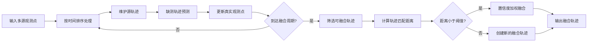

# 轨迹融合匹配关联模块 README

> 本模块用于将多源观测中属于同一目标的轨迹进行匹配、关联与融合，提升目标轨迹的连续性、稳定性与定位精度。


## 1. 模块简介

`traj_association_module.py` 提供了一个面向多源目标航迹融合的轨迹匹配关联模块。模块接收按时间组织的多源观测点数据，对每个原始目标轨迹进行维护、预测、置信度更新，并周期性地判断不同来源的轨迹是否属于同一目标；对于匹配成功的轨迹，模块会根据置信度进行加权融合，输出统一的融合后轨迹。

模块核心能力包括：

- **轨迹维护**：按目标 `id` 维护源轨迹，持续接收真实观测点。
- **运动预测**：在目标短时缺测时生成虚拟预测点，保证轨迹连续。
- **置信度衰减**：真实点具有较高置信度，预测点置信度随缺测时间增加而下降。
- **轨迹匹配**：通过重叠时间段内的加权平均距离判断轨迹是否匹配。
- **轨迹融合**：对匹配成功的轨迹进行置信度加权融合，输出统一轨迹。
- **2D / 3D 支持**：支持经纬度二维位置，也支持带高度的三维位置。

## 2. 解决思路

多源观测系统中，同一个真实目标可能会被不同传感器、不同检测链路或不同数据源生成多条轨迹。由于观测误差、采样频率差异、短时丢点和目标机动等因素，这些轨迹不会完全重合。

本模块采用以下流程完成轨迹融合：



## 3. 核心类说明

### 3.1 `AssociationConfig`

模块配置项，控制轨迹停止、融合周期、匹配阈值、预测行为和滤波参数。

| 参数 | 默认值 | 说明 |
|---|---:|---|
| `threshold_m` | `120.0` | 轨迹匹配距离阈值，单位米。 |
| `traj_stop_dt` | `30.0` | 超过该时间无真实点则认为源轨迹停止。 |
| `fuse_turn_dt` | `30.0` | 融合判断周期。 |
| `fuse_min_duration` | `60.0` | 轨迹参与融合所需的最短持续时间。 |
| `predict_minnum` | `5` | 真实点数量不足时不进行明显外推，优先保持上一位置。 |
| `timeout_steps` | `9` | 超时步数配置，保留给上层流程使用。 |
| `cycle_by_ds` | `{1:6, 2:6, 3:8, 4:8, 5:6, 6:6}` | 不同数据源的周期配置。 |
| `predict_history_len` | `20` | 预测历史长度配置。 |
| `process_noise_sigma` | `0.01` | Kalman 过程噪声。 |
| `measure_noise_sigma` | `0.1` | Kalman 观测噪声。 |

### 3.2 `TrajectoryAssociator`

模块主入口类，负责执行完整的轨迹关联与融合流程。

主要方法：

```python
associate(data: Dict[float, List[Dict[str, Any]]], ds_id: int, pos_dim: int) -> Dict[int, List[Dict[str, float | int]]]
```

参数说明：

- `data`：按时间戳组织的观测点字典。
- `ds_id`：数据源编号，预留给多数据源周期配置使用。
- `pos_dim`：位置维度，只支持 `2` 或 `3`。

返回值：

- `Dict[int, List[Dict]]`：以融合后轨迹编号为 key，以轨迹点列表为 value。

### 3.3 `_SourceTrajectory`

内部源轨迹对象，负责维护单条原始轨迹的状态，包括：

- 历史位置 `positions`
- 历史时间 `times`
- 真实点 / 预测点标记 `is_real_points`
- 点置信度 `point_confidences`
- 是否有效、是否停止、是否正在融合等状态

### 3.4 `_FusedTrajectory`

内部融合轨迹对象，负责：

- 保存已经融合的源轨迹集合
- 计算新源轨迹与当前融合轨迹的匹配距离
- 对匹配轨迹执行置信度加权融合
- 输出融合后的轨迹点

## 4. 输入数据格式

输入数据必须是：

```python
Dict[float, List[Dict[str, Any]]]
```

其中外层 key 为时间戳，value 为该时刻的观测点列表。每个观测点必须包含：

| 字段 | 类型 | 说明 |
|---|---|---|
| `ts` | `float` | 时间戳，必须与外层 key 一致。 |
| `id` | `int` | 原始轨迹 / 目标编号。 |
| `x` | `float` | 经度或 X 坐标。 |
| `y` | `float` | 纬度或 Y 坐标。 |
| `z` | `float` | 高度或 Z 坐标，仅 `pos_dim=3` 时可选。 |

二维示例：

```python
data = {
    0.0: [
        {"ts": 0.0, "id": 101, "x": 116.3910, "y": 39.9070},
        {"ts": 0.0, "id": 201, "x": 116.3912, "y": 39.9071},
    ],
    6.0: [
        {"ts": 6.0, "id": 101, "x": 116.3920, "y": 39.9080},
        {"ts": 6.0, "id": 201, "x": 116.3921, "y": 39.9081},
    ],
}
```

## 5. 输出数据格式

输出数据格式为：

```python
Dict[int, List[Dict[str, float | int]]]
```

每个输出点包含以下字段：

| 字段 | 类型 | 说明 |
|---|---|---|
| `ts` | `float` | 时间戳。 |
| `id` | `int` | 融合后轨迹编号。 |
| `tra_id` | `int` | 融合后轨迹编号，与 `id` 一致。 |
| `x` | `float` | 融合后经度或 X 坐标。 |
| `y` | `float` | 融合后纬度或 Y 坐标。 |
| `z` | `float` | 融合后高度或 Z 坐标；二维输入时为 `0.0`。 |
| `is_predicted` | `int` | 是否为预测点，`1` 表示预测点，`0` 表示真实观测融合点。 |

输出示例：

```python
{
    0: [
        {
            "ts": 0.0,
            "id": 0,
            "tra_id": 0,
            "x": 116.3911,
            "y": 39.90705,
            "z": 0.0,
            "is_predicted": 0,
        }
    ]
}
```

## 6. 使用方法

### 6.1 直接使用函数接口

```python
from traj_association_module import associate_trajectories, AssociationConfig

config = AssociationConfig(
    threshold_m=120.0,
    traj_stop_dt=30.0,
    fuse_turn_dt=30.0,
    fuse_min_duration=60.0,
)

result = associate_trajectories(
    data=data,
    ds_id=1,
    pos_dim=2,
    config=config,
)

print(result)
```

### 6.2 使用类接口

```python
from traj_association_module import TrajectoryAssociator, AssociationConfig

associator = TrajectoryAssociator(config=AssociationConfig())
result = associator.associate(data=data, ds_id=1, pos_dim=2)
```

## 7. 匹配与融合逻辑

### 7.1 轨迹预测

每个时间步开始时，模块会对仍然有效的源轨迹执行 `move(cur_t)`：

1. 如果距离最后一个真实点的时间超过 `traj_stop_dt`，轨迹被标记为停止。
2. 否则根据时间间隔 `dt` 使用运动滤波器预测当前位置。
3. 如果真实点数量不足 `predict_minnum`，预测位置保持为上一时刻位置，避免早期轨迹过度外推。
4. 预测点会被标记为虚拟点，并根据缺测时间计算置信度。

### 7.2 轨迹匹配

融合轨迹与待匹配源轨迹在重叠时间段内逐点计算距离，并以双方点置信度作为权重：

```text
平均加权距离 = Σ(距离 × 融合轨迹置信度 × 源轨迹置信度) / Σ(融合轨迹置信度 × 源轨迹置信度)
```

当平均加权距离小于 `threshold_m` 时，认为两条轨迹属于同一目标。

### 7.3 轨迹融合

匹配成功后，同一时间戳上的点按置信度加权平均：

```text
融合位置 = (位置A × 置信度A + 位置B × 置信度B) / (置信度A + 置信度B)
```

非重叠时间段的轨迹点会直接保留，从而尽可能保持完整轨迹。

## 8. 依赖环境

基础依赖：

```bash
pip install numpy filterpy geopy
```

说明：

- `numpy`：用于向量计算和加权平均。
- `filterpy`：用于内置 Kalman 滤波器。
- `geopy`：优先用于经纬度距离计算；如果不可用，模块会回退到 Haversine 公式。

如果工程中存在上级目录下的 `prediction/filter.py`，模块会优先使用其中的 `Filter` 作为外部预测滤波器；如果不存在或导入失败，则自动使用内置 KalmanFilter。

## 9. 注意事项

- `pos_dim` 只支持 `2` 或 `3`，其他值会抛出异常。
- 每个观测点的 `ts` 必须与外层时间戳 key 完全一致。
- 输入点不能包含未定义字段，二维模式下允许字段为 `ts/id/x/y`，三维模式下允许额外包含 `z`。
- 输出中的轨迹编号会重新分配，不一定等于输入源轨迹编号。
- `is_predicted=1` 的点来自预测补点，使用时可根据业务需要降低权重或过滤。
- `threshold_m` 对融合结果影响较大：阈值过小会导致同一目标无法融合，阈值过大会增加误关联风险。

## 10. 推荐目录结构

```text
project/
├── association/
│   ├── traj_association_module.py
│   └── README.md
├── prediction/
│   └── filter.py              # 可选：外部预测滤波器
└── requirements.txt
```

## 11. 快速自测

```python
from traj_association_module import associate_trajectories

data = {
    0.0: [
        {"ts": 0.0, "id": 1, "x": 116.3910, "y": 39.9070},
        {"ts": 0.0, "id": 2, "x": 116.3911, "y": 39.9071},
    ],
    30.0: [
        {"ts": 30.0, "id": 1, "x": 116.3920, "y": 39.9080},
        {"ts": 30.0, "id": 2, "x": 116.3921, "y": 39.9081},
    ],
    60.0: [
        {"ts": 60.0, "id": 1, "x": 116.3930, "y": 39.9090},
        {"ts": 60.0, "id": 2, "x": 116.3931, "y": 39.9091},
    ],
    90.0: [
        {"ts": 90.0, "id": 1, "x": 116.3940, "y": 39.9100},
        {"ts": 90.0, "id": 2, "x": 116.3941, "y": 39.9101},
    ],
}

result = associate_trajectories(data=data, ds_id=1, pos_dim=2)
for traj_id, points in result.items():
    print("traj_id:", traj_id)
    for point in points:
        print(point)
```

## 12. 版本说明

当前 README 对应 `traj_association_module.py` 的模块接口与实现逻辑，主要面向多源目标航迹匹配、轨迹预测补点和置信度加权融合场景。
